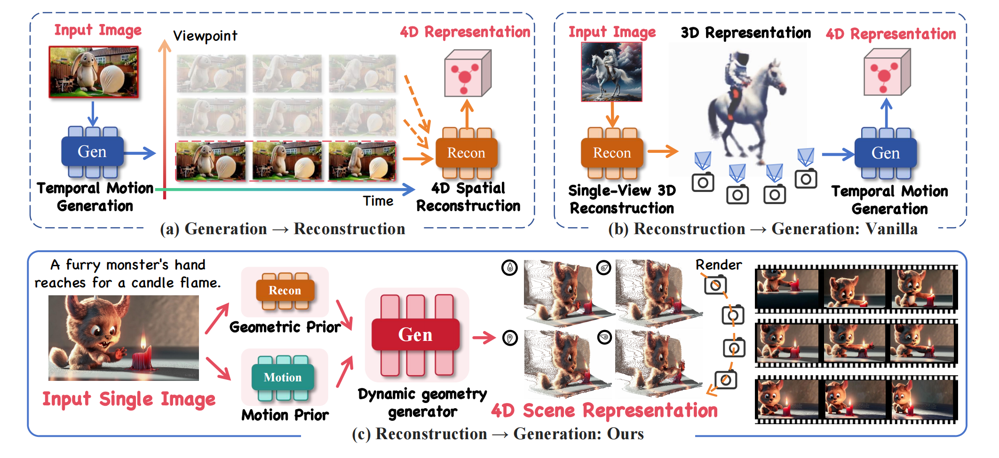

# [ECCV 2026] MoGe4D: Geometry-Aware Single-Image 4D Synthesis via Dense Trajectory Generation

<b>[Yanran Zhang](https://yanran-zhang.github.io/)<sup>\*,1</sup>, [Ziyi Wang](https://wangzy22.github.io/)<sup>\*,1</sup>, [Wenzhao Zheng](https://wzzheng.net/#)<sup>†,1</sup>, [Zheng Zhu](http://www.zhengzhu.net/)<sup>2</sup>, [Jie Zhou](https://scholar.google.com/citations?user=6a79aPwAAAAJ&hl=en)<sup>1</sup>, [Jiwen Lu](https://ivg.au.tsinghua.edu.cn/Jiwen_Lu/)<sup>1</sup></b>

<sup>1</sup>Department of Automation, Tsinghua University &nbsp;&nbsp;&nbsp; <sup>2</sup>GigaAI

<i><sup>*</sup>Equal Contribution &nbsp;&nbsp; <sup>†</sup>Corresponding Author</i>

<p align="center">
  <a href="https://github.com/Zhangyr2022/MoGe4D"></a>
  <a href="https://arxiv.org/abs/2512.05044"></a>
  <a href="https://ivg-yanranzhang.github.io/MoGe4D/"></a>
  <br>
  <a href="https://www.modelscope.cn/models/YanranZhang/MoGe4D"></a>
  <a href="https://huggingface.co/Yanran21/MoGe4D"></a>
  <a href="https://www.modelscope.cn/datasets/YanranZhang/TrajScene-60K"></a>
</p>

<div align="center">
  
</div>

## 📝 Abstract

Generating interactive and dynamic 4D scenes from a single static image remains a core challenge. Most existing generate-then-reconstruct and reconstruct-then-generate methods decouple geometry from motion, causing spatiotemporal inconsistencies and poor generalization.

To address this, we present **MoGe4D** (**Mo**tion and **Ge**ometry-aware image-to-4D synthesis), a geometry-conditioned framework that models a scene as **dense 4D point trajectories**. Instead of treating geometry and dynamics as two disconnected stages, MoGe4D starts from an initial geometric prior inferred from the input image and predicts future time-varying trajectories in a diffusion process, improving spatiotemporal coherence while preserving structural stability.

We contribute:
- 🗄️ **TrajScene-60K** — a large-scale dataset of 60,000 video samples with dense 4D point trajectories (3M+ frames, ~12B 3D point annotations).
- 🎯 **4D-STraG** (4D Scene Trajectory Generator) — a diffusion model that predicts geometry-consistent, motion-plausible trajectory fields, with *depth-guided motion normalization* and a *Motion Perception Module (MPM)*.
- 🎬 **4D-ViSM** (4D View Synthesis Module) — renders the generated 4D representation into videos under arbitrary camera trajectories.

## 🔥 News

- `[2026-07-06]` model checkpoints, and the TrajScene-60K dataset are now available on **HuggingFace** and **ModelScope**.
- `[2026-06-20]` 🎉 MoGe4D is accepted to **ECCV 2026**!
- `[2025-12-06]` Code is released.
- `[2025-12-05]` Paper submitted to arXiv.

## 🔧 Getting Started

### Installation

1. Clone the repository:
   ```bash
   git clone https://github.com/Zhangyr2022/MoGe4D.git
   cd MoGe4D
   ```
2. Create a conda environment with Python 3.10:
   ```bash
   conda create -n MoGe4D python=3.10
   conda activate MoGe4D
   ```
3. Install PyTorch (CUDA 12.4 recommended) and dependencies:
   ```bash
   conda install pytorch torchvision torchaudio pytorch-cuda=12.4 -c pytorch -c nvidia
   pip install -r requirements.txt
   ```
4. Install third-party dependencies:
   - **UniDepthV2** — follow [UniDepth](https://github.com/lpiccinelli-eth/UniDepth#)
   - **Gaussian Splatting** — follow [diff-gaussian-rasterization](https://github.com/graphdeco-inria/diff-gaussian-rasterization/tree/8064f52ca233942bdec2d1a1451c026deedd320b)

### Download Pretrained Checkpoints

We release the MoGe4D weights on both **ModelScope** and **HuggingFace**. Download them into the `./models` folder.

**Option A — ModelScope (recommended for users in mainland China):**
```bash
pip install modelscope
modelscope download --model YanranZhang/MoGe4D --local_dir ./models
```

**Option B — HuggingFace:**
```bash
pip install huggingface_hub
huggingface-cli download Yanran21/MoGe4D --local-dir ./models --resume-download
```

After download, `./models` should contain:
```
models/
├── 4D-STraG/diffusion_pytorch_model.safetensors   # 4D trajectory generator
├── 4D-ViSM/lora_diffusion_pytorch_model.safetensors  # view-synthesis LoRA
└── VAE/                                            # motion-sensitive VAE (+ training states)
```

> In addition, training also requires the base backbones [Wan2.1-Fun-V1.1-14B-Control](https://huggingface.co/alibaba-pai/Wan2.1-Fun-V1.1-14B-Control) / [Wan2.1-Fun-V1.1-14B-InP](https://huggingface.co/alibaba-pai/Wan2.1-Fun-V1.1-14B-InP), [OmniMAE](https://dl.fbaipublicfiles.com/omnivore/omnimae_ckpts/vitb_pretrain.torch), and [UniDepth](https://huggingface.co/lpiccinelli/unidepth-v2-vitl14), placed under `./models`.

## 📊 TrajScene-60K Dataset

<div align="center">
  
</div>

**TrajScene-60K** is a large-scale 4D scene dataset curated from [WebVid-10M](https://github.com/m-bain/webvid) via VLM-based filtering (CogVLM2 & DeepSeek-V3). It provides the multi-modal supervision needed to learn consistent 4D scene representations and trajectories.

| Statistic            | Value                                                                      |
| -------------------- | -------------------------------------------------------------------------- |
| Samples              | 60,000 videos                                                              |
| Frames               | 3M+                                                                        |
| 3D point annotations | ~12 billion (1.2 × 10¹⁰)                                                   |
| Resolution           | 596 × 336, 49 frames                                                       |
| Annotations          | dense 4D point trajectories · per-frame depth · occlusion masks · captions |

**Download:**
```bash
pip install modelscope
modelscope download --dataset YanranZhang/TrajScene-60K --local_dir ./data/TrajScene-60K
```

**Directory structure** — each sample is grouped into a range archive `<range>.tar.gz` (50 samples per range), covering the full 60K samples:
```
<range>.tar.gz                 # e.g. 000001_000050.tar.gz  (scenes 000001–000050)
└── <range>/
    ├── <id>.mp4                     # source video
    ├── <id>.txt                     # caption (scene content + dynamics)
    ├── <id>_dt3d_pred.pkl           # dense 4D point trajectories
    ├── <id>_dt3d_render.mp4         # rendered multi-view video
    ├── <id>_mask_render.mp4         # occlusion mask video
    └── <id>_mask_render_binary.npy  # binary occlusion mask
```

## 🚀 Usage

### Training

<details>
<summary><b>1) Motion-Sensitive VAE</b></summary>

Download [Wan2.1-Fun-V1.1-14B-Control](https://huggingface.co/alibaba-pai/Wan2.1-Fun-V1.1-14B-Control) into `./models`, then:
```bash
bash scripts/4D_STraG_training/train_vae.sh
```
</details>

<details>
<summary><b>2) 4D-STraG (Scene Trajectory Generator)</b></summary>

A joint diffusion model that simultaneously reconstructs and generates spatiotemporal point trajectories, with **Depth-Guided Motion Normalization** (scale invariance) and the **Motion Perception Module (MPM)** (motion-aware priors from the input image).

Requires [Wan2.1-Fun-V1.1-14B-Control](https://huggingface.co/alibaba-pai/Wan2.1-Fun-V1.1-14B-Control), [OmniMAE](https://dl.fbaipublicfiles.com/omnivore/omnimae_ckpts/vitb_pretrain.torch), and [UniDepth](https://huggingface.co/lpiccinelli/unidepth-v2-vitl14) under `./models`.
```bash
bash scripts/4D_STraG_training/train_wan.sh
```
</details>

<details>
<summary><b>3) 4D-ViSM (View Synthesis Module)</b></summary>

Leverages the dense 4D point cloud to synthesize high-fidelity novel-view videos, filling dis-occluded regions with generative priors. Requires [Wan2.1-Fun-V1.1-14B-InP](https://huggingface.co/alibaba-pai/Wan2.1-Fun-V1.1-14B-InP) under `./models`.
```bash
bash scripts/4D_ViSM_training/train.sh
```
</details>

<details>
<summary><b>Memory optimization (DeepSpeed, if OOM)</b></summary>

- **Zero-2:** add `--use_deepspeed --deepspeed_config_file config/zero_stage2_config.json`
- **Zero-3 (max savings):** `--zero_stage 3 --zero3_save_16bit_model true --zero3_init_flag true --use_deepspeed --deepspeed_config_file config/zero_stage3_config.json`
</details>

### Inference

```bash
bash scripts/inference/infer.sh        # whole pipeline (image → 4D scene → multi-view videos)
bash scripts/inference/infer_vae.sh    # VAE only
```

## 🎨 Results Showcase

<table>
<tr>
<td width="33%" align="center"><b>Input</b></td>
<td width="33%" align="center"><b>4D Point Tracking (4D-STraG)</b></td>
<td width="33%" align="center"><b>Multi-View Videos (4D-ViSM)</b></td>
</tr>
<tr>
<td colspan="3"><i>A brown bear walks across rocky terrain.</i></td>
</tr>
<tr>
<td align="center"></td>
<td align="center"><video src="https://github.com/user-attachments/assets/21c0acd3-4ef9-46a5-85af-a0d0fd51bfb4" width="100%" muted></video></td>
<td align="center"><video src="https://github.com/user-attachments/assets/8c4ec888-4284-432b-90d8-d1937af2f7a3" width="100%" muted></video></td>
</tr>
<tr>
<td colspan="3"><i>A camel walks along a path in a sunny zoo enclosure.</i></td>
</tr>
<tr>
<td align="center"></td>
<td align="center"><video src="https://github.com/user-attachments/assets/59d1b3db-a933-44d7-a89d-1e990ba5f6c7" width="100%" muted></video></td>
<td align="center"><video src="https://github.com/user-attachments/assets/3618d7e5-cfdc-49ba-9520-80c06637e10c" width="100%" muted></video></td>
</tr>
</table>

## 💡 Methodology

<div align="center">
  
</div>

MoGe4D couples geometric modeling with motion generation through two core components:
- **4D-STraG** — a diffusion-based trajectory generator that predicts geometry-consistent and motion-plausible 4D point trajectories conditioned on an initial geometric prior, using *depth-guided motion normalization* and a *Motion Perception Module*.
- **4D-ViSM** — a view-synthesis module that renders the generated 4D point-cloud representation into videos along arbitrary camera trajectories.

## 🙏 Acknowledgments

We thank the open-source community, especially [Wan2.1](https://github.com/Wan-Video/Wan2.1), [Omnivore](https://github.com/facebookresearch/omnivore), and [VideoX-Fun](https://github.com/aigc-apps/VideoX-Fun).

## 📖 Citation

If you find our work useful, please consider citing:

```bibtex
@inproceedings{zhang2026moge4d,
  title={Geometry-Aware Single-Image 4D Synthesis via Dense Trajectory Generation},
  author={Zhang, Yanran and Wang, Ziyi and Zheng, Wenzhao and Zhu, Zheng and Zhou, Jie and Lu, Jiwen},
  booktitle={European Conference on Computer Vision (ECCV)},
  year={2026}
}
```

## 📧 Contact

For questions and discussions, please open an issue or contact:
- Yanran Zhang: [GitHub](https://github.com/Zhangyr2022/) · zhangyr21@mails.tsinghua.edu.cn
- Ziyi Wang: [Homepage](https://wangzy22.github.io/)
